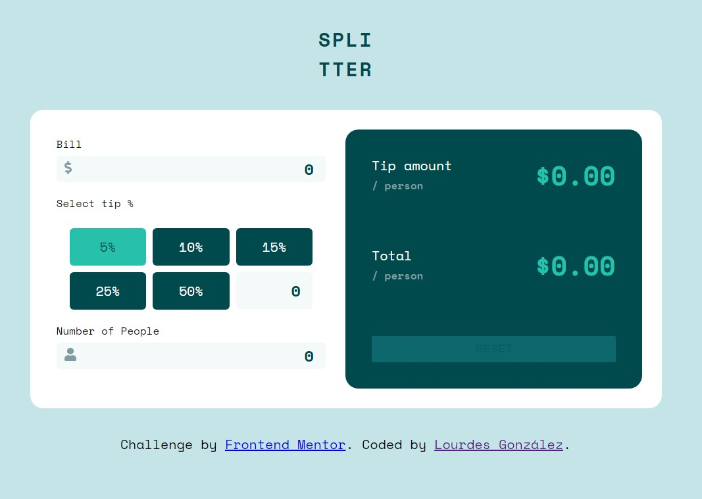

# Frontend Mentor - Tip calculator app

## Welcome! 👋

This is a solution to the Tip calculator app challenge on Frontend Mentor.

[Frontend Mentor](https://www.frontendmentor.io) challenges help you improve your coding skills by building realistic projects.
 
For this challenge I used HTML, CSS and JavaScript.

## The challenge

The challenge is to build out  tip calculator app and get it looking as close to the design as possible.

### Links

- Solution CODE: [https://github.com/lougc/tip-calculator-app-main]
- Live Site URL: [https://lougc.github.io/tip-calculator-app-main/]

## My process

### Built with

- Semantic HTML5 markup
- CSS custom properties
- Flexbox
- CSS Grid
- JavaScript

## Author

- Website - [https://lougc.github.io/portfolio]
- Frontend Mentor - [https://www.frontendmentor.io/profile/lougc]
- Linkedin - [https://www.linkedin.com/in/lougc/]